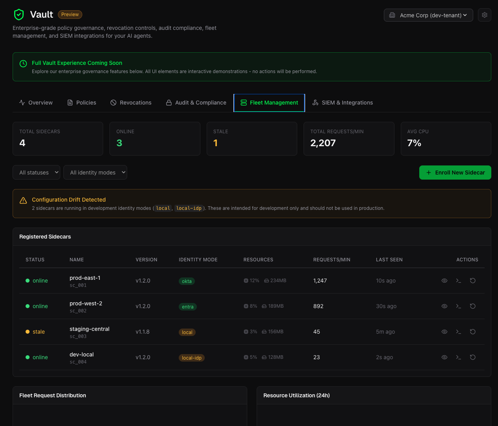
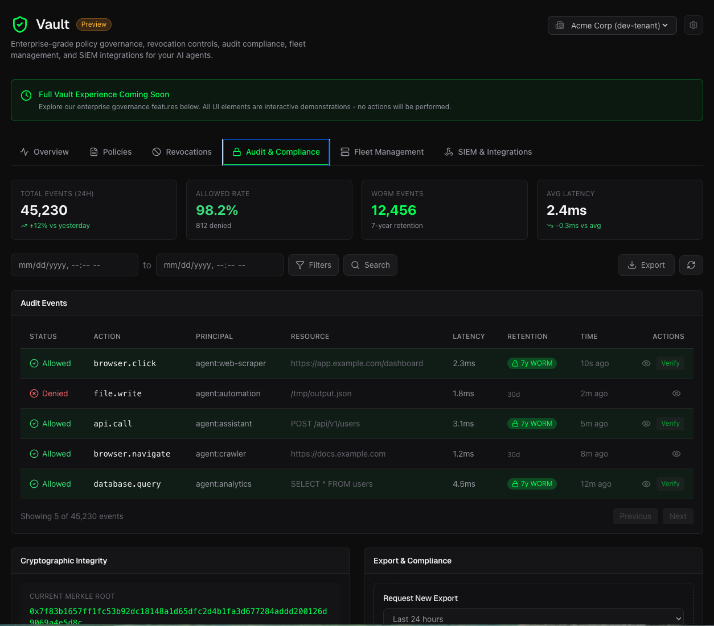
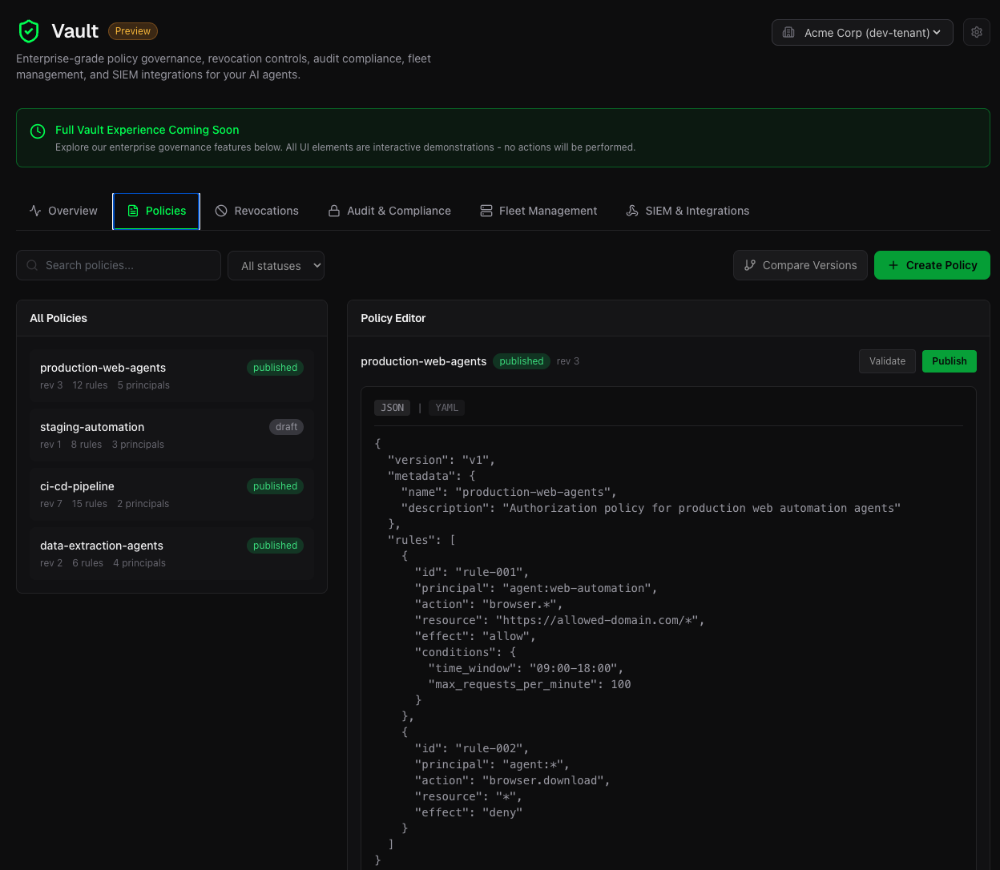
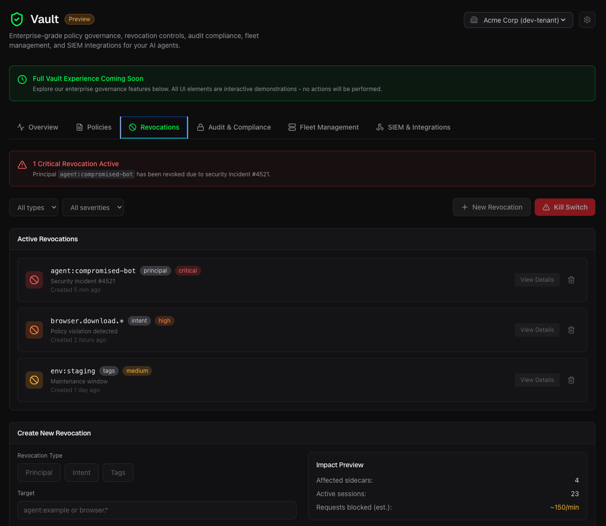
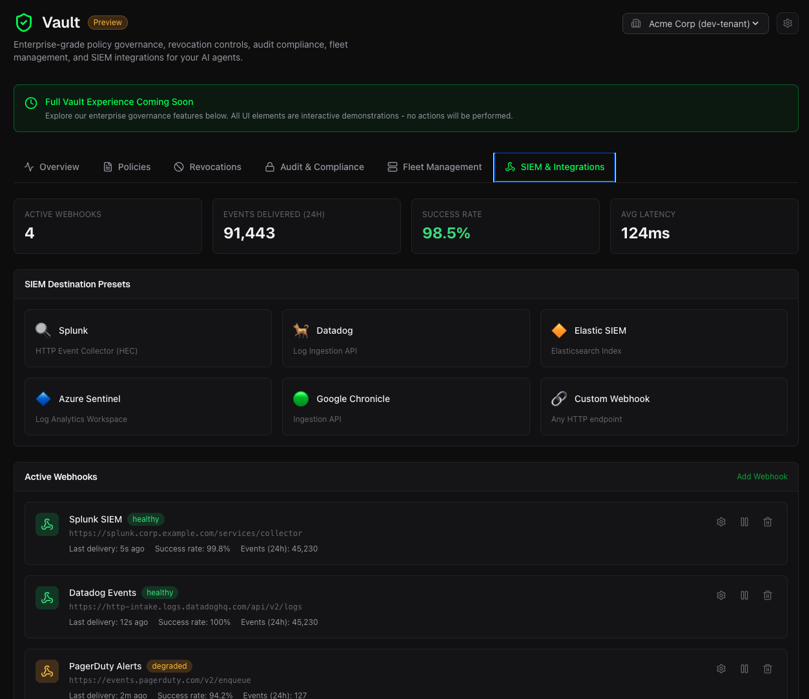

# predicate-temporal

Temporal.io Worker Interceptor for Predicate Authority Zero-Trust authorization.

<video src="https://github.com/user-attachments/assets/511b6d38-90ab-413e-8af6-a89fc459eea5" autoplay loop muted playsinline></video>

**Powered by [predicate-authority](https://github.com/PredicateSystems/predicate-authority) SDK:** [Python](https://github.com/PredicateSystems/predicate-authority) | [TypeScript](https://github.com/PredicateSystems/predicate-authority-ts)

This package provides a pre-execution security gate for all Temporal Activities, enforcing cryptographic authorization mandates before any activity code runs.

## Demo: Hack vs Fix

See Predicate Authority block dangerous Temporal activities in real-time:

```bash
git clone https://github.com/PredicateSystems/predicate-temporal-python
cd predicate-temporal-python/examples/demo
./start-demo-native.sh
```

**Requirements:** Python 3.11+, [Temporal CLI](https://docs.temporal.io/cli#install)

The demo shows 4 scenarios:
1. **Legitimate order processing** → ✅ ALLOWED
2. **Delete order attack** → ❌ BLOCKED by `deny-delete-operations`
3. **Admin override attack** → ❌ BLOCKED by `deny-admin-operations`
4. **Drop database attack** → ❌ BLOCKED by `deny-drop-operations`

## Sidecar Prerequisite

This package requires the **Predicate Authority Sidecar** daemon to be running. The sidecar is a high-performance Rust binary that handles policy evaluation and mandate signing locally—no data leaves your infrastructure.

| Resource | Link |
|----------|------|
| Sidecar Repository | [predicate-authority-sidecar](https://github.com/PredicateSystems/predicate-authority-sidecar) |
| Download Binaries | [Latest Releases](https://github.com/PredicateSystems/predicate-authority-sidecar/releases) |
| License | MIT / Apache 2.0 |

### Quick Sidecar Setup

**Option A: Docker (Recommended)**
```bash
docker run -d -p 8787:8787 ghcr.io/predicatesystems/predicate-authorityd:latest
```

**Option B: Download Binary**
```bash
# macOS (Apple Silicon)
curl -fsSL https://github.com/PredicateSystems/predicate-authority-sidecar/releases/latest/download/predicate-authorityd-darwin-arm64.tar.gz | tar -xz
chmod +x predicate-authorityd
./predicate-authorityd --port 8787 --policy-file policy.json

# Linux x64
curl -fsSL https://github.com/PredicateSystems/predicate-authority-sidecar/releases/latest/download/predicate-authorityd-linux-x64.tar.gz | tar -xz
chmod +x predicate-authorityd
./predicate-authorityd --port 8787 --policy-file policy.json
```

See [all platform binaries](https://github.com/PredicateSystems/predicate-authority-sidecar/releases) for Linux ARM64, macOS Intel, and Windows.

**Verify it's running:**
```bash
curl http://localhost:8787/health
# {"status":"ok"}
```

## Installation

```bash
pip install predicate-temporal
```

## Quick Start

```python
from temporalio.worker import Worker
from predicate_temporal import PredicateInterceptor
from predicate_authority import AuthorityClient

# Initialize the Predicate Authority client
ctx = AuthorityClient.from_env()

# Create the interceptor
interceptor = PredicateInterceptor(
    authority_client=ctx.client,
    principal="temporal-worker",
)

# Create worker with the interceptor
worker = Worker(
    client=temporal_client,
    task_queue="my-task-queue",
    workflows=[MyWorkflow],
    activities=[my_activity],
    interceptors=[interceptor],
)
```

## How It Works

The interceptor sits in the Temporal activity execution pipeline:

1. Temporal dispatches an activity to your worker
2. **Before** the activity code runs, the interceptor extracts:
   - Activity name (action)
   - Activity arguments (context)
3. The interceptor calls `AuthorityClient.authorize()` to request a mandate
4. If **denied**: raises `PermissionError` - activity never executes
5. If **approved**: activity proceeds normally

This ensures that no untrusted code or payload reaches your OS until it has been cryptographically authorized.

## Configuration

### Environment Variables

Set these environment variables for the Authority client:

```bash
export PREDICATE_AUTHORITY_POLICY_FILE=/path/to/policy.json
export PREDICATE_AUTHORITY_SIGNING_KEY=your-secret-key
export PREDICATE_AUTHORITY_MANDATE_TTL_SECONDS=300
```

### Policy File

Create a policy file that defines allowed activities:

```json
{
  "rules": [
    {
      "name": "allow-safe-activities",
      "effect": "allow",
      "principals": ["temporal-worker"],
      "actions": ["process_order", "send_notification"],
      "resources": ["*"]
    },
    {
      "name": "deny-dangerous-activities",
      "effect": "deny",
      "principals": ["*"],
      "actions": ["delete_*", "admin_*"],
      "resources": ["*"]
    }
  ]
}
```

## API Reference

### PredicateInterceptor

```python
PredicateInterceptor(
    authority_client: AuthorityClient,
    principal: str = "temporal-worker",
    tenant_id: str | None = None,
    session_id: str | None = None,
)
```

**Parameters:**

- `authority_client`: The Predicate Authority client instance
- `principal`: Principal ID used for authorization requests (default: "temporal-worker")
- `tenant_id`: Optional tenant ID for multi-tenant setups
- `session_id`: Optional session ID for request correlation

### PredicateActivityInterceptor

The inbound interceptor that performs the actual authorization check. Created automatically by `PredicateInterceptor`.

## Error Handling

When authorization is denied, the interceptor raises a `PermissionError`:

```python
try:
    await workflow.execute_activity(
        dangerous_activity,
        args,
        start_to_close_timeout=timedelta(seconds=30),
    )
except ActivityError as e:
    if isinstance(e.cause, ApplicationError):
        # Handle authorization denial
        print(f"Activity blocked: {e.cause.message}")
```

## Development

```bash
# Install dev dependencies
pip install -e ".[dev]"

# Run tests
pytest

# Type checking
mypy src

# Linting
ruff check src tests
ruff format src tests
```

## Audit Vault and Control Plane

The Predicate sidecar and SDKs are 100% open-source and free for local development and single-agent deployments.

However, when deploying a fleet of AI agents in regulated environments (FinTech, Healthcare, Security), security teams cannot manage scattered YAML files or local SQLite databases. For production fleets, we offer the **Predicate Control Plane** and **Audit Vault**.

<table>
<tr>
<td width="50%" align="center">

<br><em>Real-time dashboard with authorization metrics</em>
</td>
<td width="50%" align="center">

<br><em>Fleet management across all sidecars</em>
</td>
</tr>
<tr>
<td width="50%" align="center">

<br><em>WORM-ready audit ledger with 7-year retention</em>
</td>
<td width="50%" align="center">

<br><em>Centralized policy editor</em>
</td>
</tr>
<tr>
<td width="50%" align="center">

<br><em>Global kill-switches and revocations</em>
</td>
<td width="50%" align="center">

<br><em>SIEM integrations (Splunk, Datadog, Sentinel)</em>
</td>
</tr>
</table>

**Control Plane Features:**

* **Global Kill-Switches:** Instantly revoke a compromised agent's `principal` or `intent_hash`. The revocation syncs to all connected sidecars in milliseconds.
* **Immutable Audit Vault (WORM):** Every authorized mandate and blocked action is cryptographically signed and stored in a 7-year, WORM-ready ledger. Prove to SOC2 auditors exactly *what* your agents did and *why* they were authorized.
* **Fleet Management:** Manage your fleet of agents with total control
* **SIEM Integrations:** Stream authorization events and security alerts directly to Datadog, Splunk, or your existing security dashboard.
* **Centralized Policy Management:** Update and publish access policies across your entire fleet without redeploying agent code.

**[Learn more about Predicate Systems](https://www.predicatesystems.ai)**

---

## License

MIT
